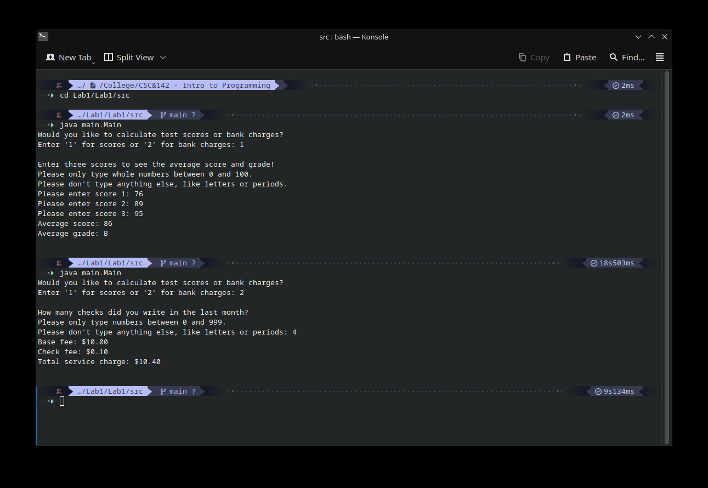

# Assignment purpose
This is my code for a computer science college assignment, specifically CSC 142 lab 1 (assignment 2) with Solmaz Monir. 
# Code Purpose
Per assignment requirements this code does two things: calculating average student grades and calculating bank fees. 
# Usage Example
Navigate to the src folder, run ‘java main.Main’, and follow the on-screen instructions. 

# Challenges Faced
Most of my experience is in Python, so the syntax and compiling took a bit of figuring out. Git is also something that I’ve used but not very much, so figuring out how to use EGit took longer than I care to admit. 
